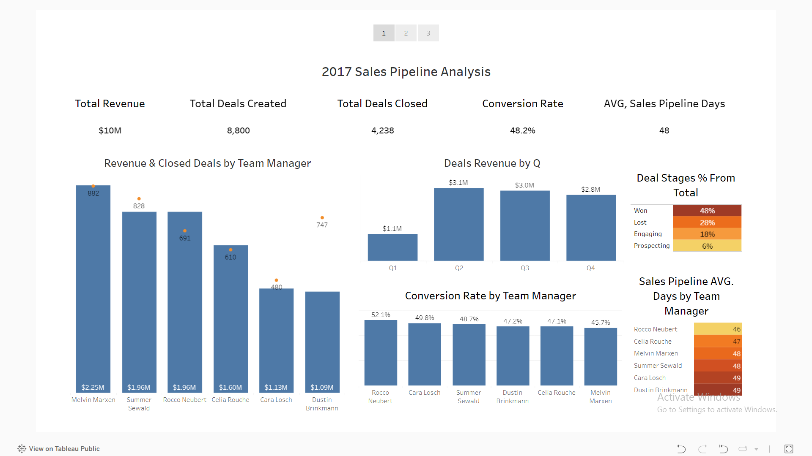
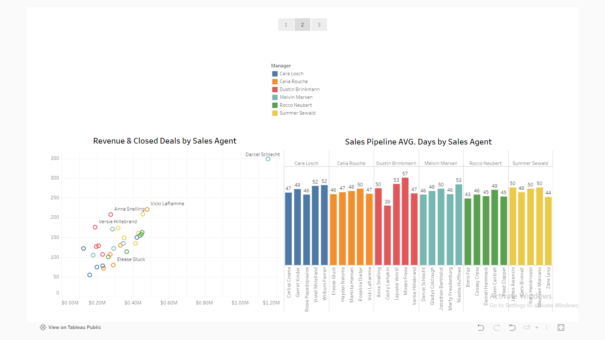
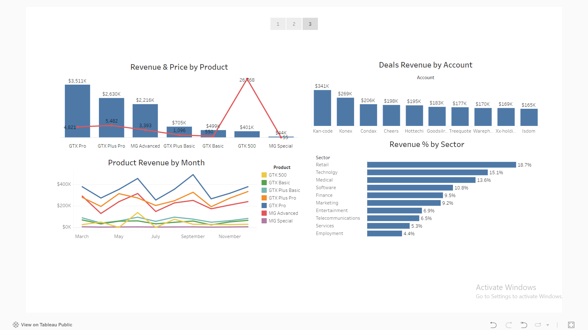

# Overview

An Analysis made on 2017 sales pipeline records & a comparsions between the sales teams & between the sold products.

For Data Source click here: [Data Source](/Source_Data/Sales_Pipeline.zip/)

For Tableau Public click here: [Tableau Public](https://public.tableau.com/views/CRM_Sales_Opportunities/Story1?:language=en-US&:sid=&:redirect=auth&:display_count=n&:origin=viz_share_link)

# Tools I Used

- **Tableau:** For Data Cleaning & Visualization.

# KPIs

- Total Revenue
- Total Deals Created
- Total Deals Closed
- Conversion Rate
- AVG. Sales Pipeline Days

# The Analysis

### 1. Revenue & Closed Deals by Team Manager
### 2. Conversion Rate by Team Manager
### 3. Sales Pipeline AVG. Days by Team Manager
### 4. Deals Revenue by Q
### 5. Deals Stages % From Total

### 6. Revenue & Closed Deals by Sales Agent
### 7. Sales Pipeline AVG. Days by Sales Agent

### 8. Revenue & Price by Product
### 9. Product Revenue by Month
### 10. Deals Revenu by Account
### 11. Revenu % by Sector

# Insights

#### 1. 

